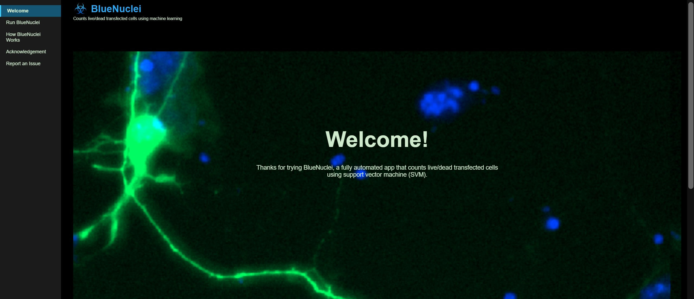

# BlueNuclei
## Introduction
BlueNuclei is a fully automated, SVM-powered, Python-based tool for identifying and classifying live/dead transfected neurons from dual-channel fluorescent images. 

It is a locally execatable app with a user friendly web-based interface. No programming skills, environment setup, package installation, or speciazlied hardware/software (not even Python) is needed. Simply download it and click to run. The "requirements.txt" file is intended for development only, not for users.
## User Interface

  

## How it works
Refer to "BlueNuclei_workflow.svg" for a visual illustration of how BlueNuclei works under the hood. Briefly, BlueNuclei consists of two integrated modules: 
Module 1 takes a dual-channel image as input and selectively identifies nuclei of transfected neurons by first detecting cytoplasmic territories in the GFP channel using thresholding and shape-based filtering, followed by projecting them onto the DAPI channel to delineate their enclosed nuclear contours based on high-contrast edge pixels. The coordinates of these nuclei will be ported to module 2.
module 2 predicts whether a nucleus is “live” or “dead” using a supervised linear SVM classifier trained on five subnuclear features designed to mimic human visual assessment: spottiness, spot distribution, edge gradient, area, and intensity. 

For full technical details, refer to the sources codes ("BlueNuclei_utils.py") or read our paper.
## Notes
Only CZI files from Zeiss microscopes are supported under the current version (BlueNuclei v1.0).

